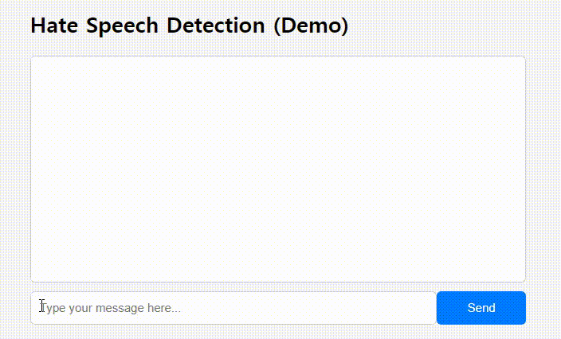
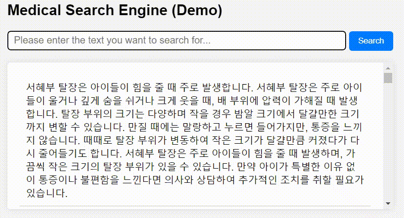
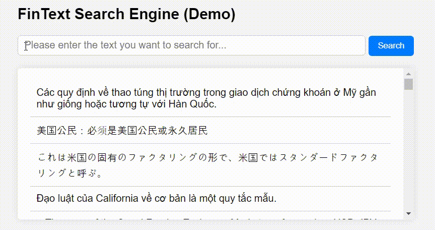
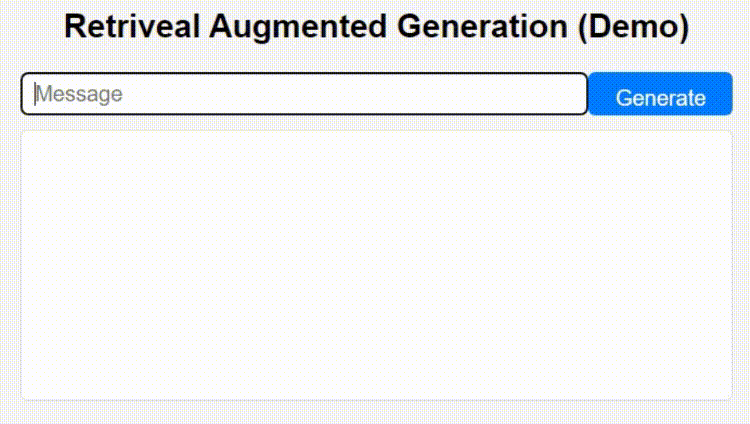
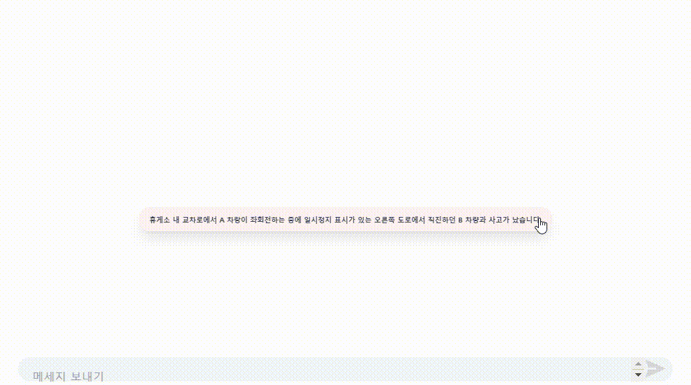
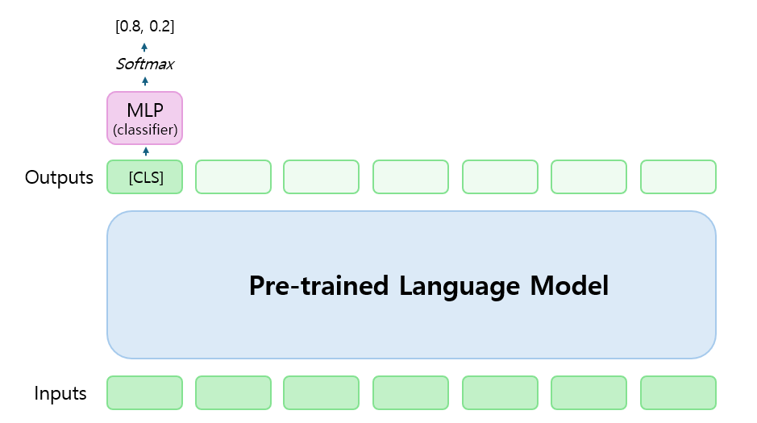
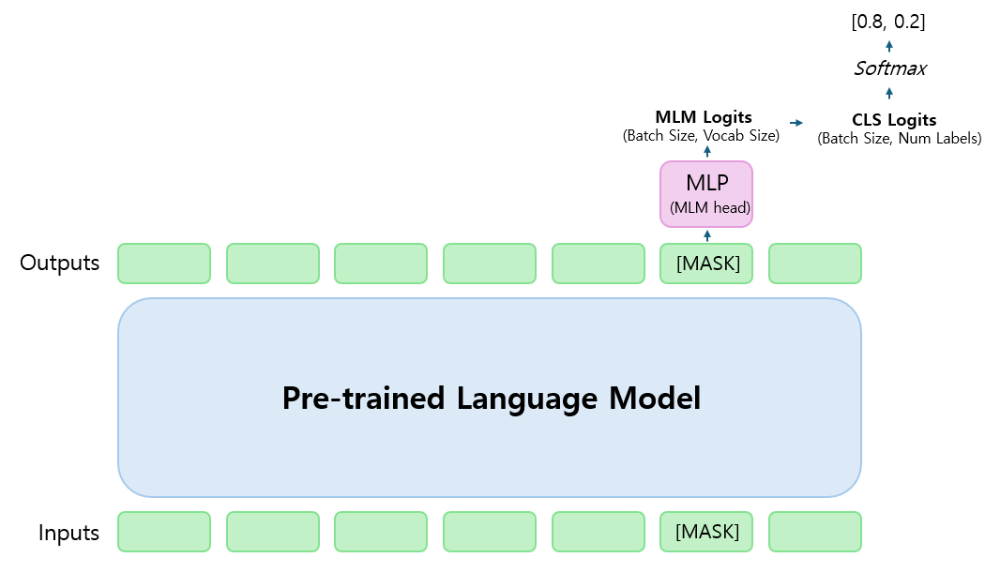
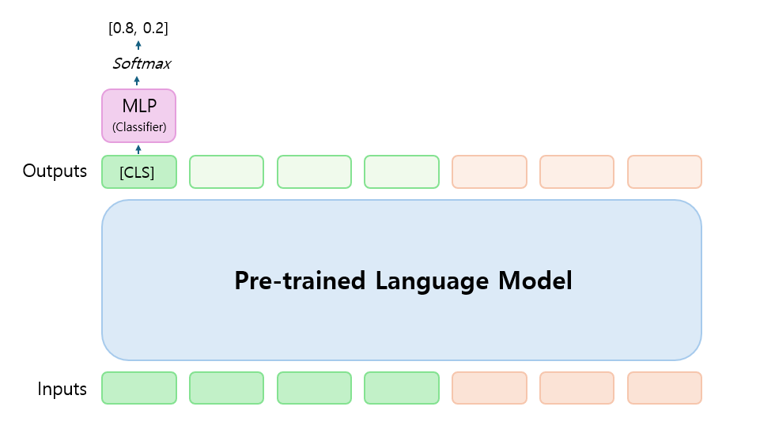
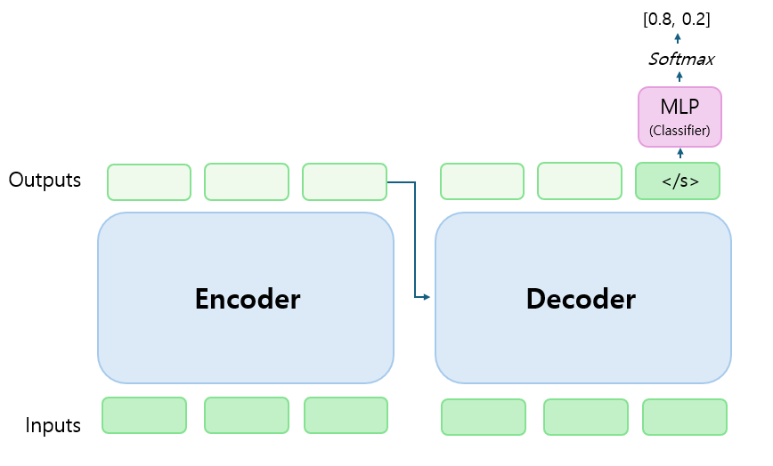

# 김민석의 NLP 포트폴리오

#### 📚 **INTRO**                

&nbsp;&nbsp;&nbsp;&nbsp;&nbsp; 안녕하세요! NLP 엔지니어 **김민석**입니다.             
&nbsp;&nbsp;&nbsp;&nbsp;&nbsp; 도메인의 **언어적 특성**을 다룰 수 있는 모델을 만듭니다.                        
&nbsp;&nbsp;&nbsp;&nbsp;&nbsp; 금융, 의료, 법률 등 **다양한 도메인**을 위한 모델을 개발한 경험이 있습니다. 
&nbsp;&nbsp;&nbsp;&nbsp;&nbsp;                

#### 📚 **COURSES**
- Studies in Computational Linguistics 1 (Natural Language Processing) 
- Studies in Computational Linguistics 2 (Transformer-based Pretrained Models and Prompt Tuning)
- Seminar in Computational Linguistics (Training and Tuning of Large Language Models) [\[repo\]](https://github.com/snumin44/HyDE-RAG)
- Studies in Computational Linguistics 2 (Large Language Models and Linguistic Probing) [\[repo\]](https://github.com/snumin44/Language-Neutrality-Probing)

#### 📚 **ACTIVITIES**
- Basic Computing: First Adventures in Computing 튜터 (2022.09 ~ 2022.12) 
- Language Data Processing 조교 (2023.09 ~ 2024.08)
- 경제·금융 분야에 특화된 언어 모델 개발 연구 참여 (시행기관: 한국은행, 2023.07 ~ 2023.12)
- 한국어 의료·법률 문서의 의미적 검색 방법론 연구 참여 (시행기관: 서울대학교, 2022.09 ~ 2023.08)
- BERT 기반 한국어 사전학습모델 확장과 한국어 문장 임베딩 KR-SBERT 구축 연구 참여 (시행기관: 한국연구재단, 2022.07 ~ 2023.06)

#### 📚 **PROJECTS**
- [1. (표현의 자유를 보장하는) **비속어 탐지 모델**](#1-표현의-자유를-보장하는-비속어-탐지-모델)
- [2. (한/영 의료 용어를 인식하는) **의료 분야 검색 모델**](2-한영-의료-용어를-인식하는-의료-분야-검색-모델)
- [3. (다양한 언어를 처리하는) **금융 분야 문장 검색 모델**](3-다양한-언어를-처리하는-금융-분야-문장-검색-모델)
- [4. (RAG 파이프라인을 이용한) **검색 기반 한국어 LLM**](4-rag-파이프라인을-이용한-검색-기반-한국어-llm)
- [5. (교통사고 과실을 계산하는) **웹기반 한국어 LLM 개발 참여**](5-교통사고-과실을-계산하는-웹기반-한국어-llm-개발-참여)       
- [6. (4가지 방법론을 통한) **뉴스 기사 토픽 분류 모델**](6-4가지-방법론을-통한-뉴스-기사-토픽-분류-모델) 


&nbsp;&nbsp;&nbsp;&nbsp;&nbsp;                

## 1. (표현의 자유를 보장하는) 비속어 탐지 모델
> 개인 프로젝트      
> 언어: Python         
> 기술 스택: Pytorch        
> 모델 코드: [https://github.com/snumin44/hate-speech-detection](https://github.com/snumin44/hate-speech-detection)           



유저의 비속어를 필터링하는 모델입니다.          
표현의 자유를 보장하기 위해 '감탄사' 또는 '자신을 향한 비속어'는 필터링되지 않도록 모델링했습니다.

**ⅰ. 문제 의식**
- 서비스 이용자의 유형에 따라 **비속어 필터링의 기준**이 다를 수 있습니다.  
- 예를 들어, 연령 제한이 있는 게임에서는 **감탄사**나 **자신을 향한 비속어**를 관대하게 처리할 수 있습니다.    
```
예) (감탄사) ㅅㅂ... 이 맵 존나 어려워서 깰 수가 없겠는디ㅋㅋ 
    (자신을 향한 비속어) 이 게임을 돈 주고 산 내가 진짜 ㅄ이지ㅋㅋ
```

**ⅱ. 모델 및 데이터 선택**
- 유저의 채팅을 신속하게 처리하기 위해 **CNN + GRU 구조**의 모델을 선택했습니다.  
- SmileGate, BEEP! 등의 오픈 데이터를 사용했고, **검수**를 통해 위 사례에 해당하는 샘플의 레이블을 수정했습니다.
  - 보통의 Hate Speech 기준대로 타인을 향한 욕설, 성차별, 지역 비하 등은 그대로 <ins> 필터링되도록 </ins> 했습니다. 
  - 표현의 자유를 최대한 보장하기 위해 감탄사나 자신을 향한 비속어는 <ins> 필터링되지 않도록 </ins> 했습니다.
```
예) (원본) 이 게임을 돈 주고 산 내가 진짜 ㅄ이지ㅋㅋ → Hate Speech 'True'
    (수정) 이 게임을 돈 주고 산 내가 진짜 ㅄ이지ㅋㅋ → Hate Speech 'False'
```

**ⅲ. 초성 및 특수문자 비속어 처리**
- 초성을 이용한 비속어 처리를 위해 **자음과 모음 단위**로 모델을 학습했습니다.
  - 유니코드의 초성/중성/종성이 바뀌는 주기를 이용해 각 음절을 자모에 맵핑했습니다.   
- 특수문자를 어휘사전의 각 자모에 맵핑하는 기능을 추가해 특수문자 욕설도 필터링되도록 했습니다.
```
예) 刀, ㉠ → ㄱ
    人, ㉦ → ㅅ 
```

**ⅳ. 테스트용 웹 개발**
- Django를 이용해 직접 채팅을 입력해볼 수 있는 **테스트용 웹**을 구현했습니다.
- 대량의 채팅을 실시간으로 처리하는 상황을 가정하고 **비동기 프로그래밍**을 적용했습니다.
  - 비동기 방식의 프로그래밍은 파이썬의 **asyncio 모듈**을 사용해 구현했습니다.   
  - 사용자의 채팅을 병렬적으로 처리할 수 있어 채팅이 끊기는 문제를 방지할 수 있습니다.   
            
**ⅴ. 문제 해결**     
- **필터링의 기준을 조정**함으로써 비속어가 포함되기만 하면 무조건 필터링되는 문제를 완화했습니다.   
- 이를 통해 상대방을 향한 비속어는 규제하는 한편, 개인의 **표현의 자유**를 최대한 보장할 수 있습니다.

**ⅵ. 기타 문제 해결**   
- 오픈 데이터 셋만 사용할 경우 모델에게 **필터링 기준**을 명확히 학습시키는 데 한계가 있었습니다.
  - 대부분의 샘플이 서비스의 유형과 상관 없이 필터링되어야 할 문장으로 이루어졌기 때문입니다.  
- 이 문제를 완화하기 위해 게임 커뮤니티에서 비속어 문장을 **직접 수집**해 데이터를 증강했습니다.
  - **감탄사**나 **자신을 향한 비속어**가 포함된 문장을 중심으로 데이터를 증강했습니다. 
  - 이를 통해 위 데모에서처럼 모델에게 필터링 기준을 보다 분명히 학습시킬 수 있었습니다.  
```
예) 시발 내 보석이!!!! → Hate Speech 'False'
    이거 1장만 깨고 가만히 놔뒀는데 ㅁㅊ 다시 다 깨야되나 → Hate Speech 'False'
    그 지랄같은 초기버전으로도 재미는 있었어 재미는 → Hate Speech 'False'
    개같이 노한글 ㅜㅜ → Hate Speech 'False'
```
  
&nbsp;&nbsp;&nbsp;  
<div align=right> 
            
  📚[PROJECTS 로 돌아가기](#-projects)   
  
</div>
&nbsp;&nbsp;&nbsp;        
&nbsp;&nbsp;&nbsp;    

## 2. (한/영 의료 용어를 인식하는) 의료 분야 검색 모델  
> 개인 프로젝트     
> 언어: Python         
> 기술 스택: Pytorch, Faiss        
> 모델 코드: [https://github.com/snumin44/SapBERT-KO-EN](https://github.com/snumin44/SapBERT-KO-EN)                



의료 분야 텍스트를 검색하는 모델입니다.     
한·영 혼용체로 이루어진 의료 텍스트를 처리하기 위해 한·영 병명을 인식할 수 있도록 했습니다.       
 
**ⅰ. 문제 의식**
- 한국의 의료 텍스트는 **한·영 혼용체(code-mixed text)** 로 이루어져 있습니다.           
- 동일한 질병이 다양한 용어로 표현되는 경우가 많아 일반적인 검색 모델로는 처리가 어렵습니다.
```
예) 고혈압 = Hypertension = High Blood Pressure = HTN = HBP
    → "고혈압으로 인한 신부전"
    → "HTN으로 인한 renal failure"     
```

**ⅱ. 한·영 의료 용어 정렬 (Post-training)**
- 동일한 병명 간의 유사도를 높임으로써, 모델이 **한·영 동의어**를 인식 및 처리할 수 있도록 했습니다.
- **한국보건의료용어표준(KOSTOM)** 의 한·영 병명과 코드를 각각 데이터와 레이블로 사용했습니다.
-  유사도 학습에는 Metric-Learning 의 손실 함수 중 하나인 **Multi Similarity Loss** 를 사용했습니다.  
```
예) C3843080 || 고혈압 질환 
    C3843080 || Hypertension
    C3843080 || High Blood Pressure
    C3843080 || HTN
    C3843080 || HBP
```

**ⅲ. 검색 모델 학습 (Fine-tuning)**
- 직접 구현한 **[Dense Passage Retrieval(DPR)-KO](https://github.com/snumin44/DPR-KO)** 코드를 이용해 Bi-Encoder 구조의 검색 모델을 학습했습니다.  
- Fine-tuning 을 위한 데이터로 AI HUB의 '[초거대 AI 헬스케어 질의 응답 데이터](https://www.aihub.or.kr/aihubdata/data/view.do?currMenu=115&topMenu=100&dataSetSn=71762)'를 사용했습니다.
- 텍스트 내 한국어 병명을 함께 제공된 영어 병명으로 대체해 한·영 혼용체 데이터를 증강했습니다.
```
예) 한국어 병명: 고혈압
    영어 병명: Hypertenstion
    질의 (원본): 아버지가 고혈압인데 그게 뭔지 모르겠어. 고혈압이 뭔지 설명좀 해줘.
    질의 (증강): 아버지가 Hypertenstion 인데 그게 뭔지 모르겠어. Hypertenstion 이 뭔지 설명좀 해줘.
``` 

**ⅳ. 문제 해결** 
- 이렇게 학습한 검색 모델로 의료 분야의 **한·영 혼용체(code-mixed text)** 텍스트를 다룰 수 있습니다.   
- 위 데모에서 '한·영 혼용체 질의'에 대응하는 '한국어 텍스트'가 잘 검색되는 것을 확인할 수 있습니다.
- 반대로 '한국어 질의'에 대응하는 '한·영 혼용체 텍스트'를 검색하는 것도 가능합니다.

**ⅴ. 기타 문제 해결**
- Post-training 단계에서 **Multi Similarity Loss** 가 수렴하지 않고 발산하는 문제가 발생했습니다.
  - 유사도 차이를 조절하기 위해 나누어주었던 **temperature** 로 인해 값이 너무 커져 발생한 문제였습니다.
  - 유사도 값이 지나치게 커서 Multi Similarity Loss 내의 **지수함수**가 inf 로 발산했던 것입니다.   
- temperature 를 0.05 에서 1로 변경함으로써 모델의 학습을 안정화시킬 수 있었습니다. 
```python
문제 코드)
pos_exp = torch.exp(-self.scale_pos * ((pos_matrix / temperature) - self.threshold))
pos_exp = torch.where(pos_mask > 0.0, pos_exp, torch.zeros_like(pos_exp))
```
&nbsp;&nbsp;&nbsp;  
<div align=right> 
            
  📚[PROJECTS 로 돌아가기](#-projects)   
  
</div>
&nbsp;&nbsp;&nbsp;        
&nbsp;&nbsp;&nbsp;          


## 3. (다양한 언어를 처리하는) 금융 분야 문장 검색 모델
> 개인 프로젝트         
> 언어: Python            
> 기술 스택: Pytorch, Faiss         
> 모델 코드: [https://github.com/snumin44/FinCSE-Multilingual](https://github.com/snumin44/FinCSE-Multilingual)                          



금융 분야 텍스트를 검색하는 모델입니다.     
세계 각국의 금융 텍스트를 검색하기 위해 다양한 언어를 처리할 수 있도록 했습니다.     

**ⅰ. 문제 의식**
- 한국은행 LLM 구축 과제에 참여하며 금융 현장에서 **다양한 언어**를 다룬다는 사실을 알게 되었습니다.   
- 하지만 **금융 분야**처럼 전문적인 도메인의 경우 다양한 언어를 지원하는 모델이 많지 않습니다.
- 금융 분야를 위한 **임베딩 모델**이 있다면 일반적인 검색은 물론, LLM을 보완하는 기능도 할 수 있습니다.     

**ⅱ. 학습 데이터 선택**
- 다국어 임베딩 모델을 학습하기 위해 AI HUB의 '[금융 분야 다국어 병렬 말뭉치 데이터](https://aihub.or.kr/aihubdata/data/view.do?currMenu=115&topMenu=100&dataSetSn=71782)'를 사용했습니다.
- **'한국어-외국어(영어, 중국어, 일본어, 인도네시아어, 베트남어)'** 구성의 병렬 문장입니다. 
```
예) 이처럼 금융상품의 경우 판매단계에서 금융회사의 ... 상품의 권유는 기본이고 필수라 할 것이다.(한국어)
    像这样，金融商品在销售阶段，提供金融公司适当的信息和推荐适合金融消费者的商品是基本，也是必须的.(중국어)
```

**ⅲ. 모델 구현 및 학습**
- 직접 구현한 **[SimCSE-KO](https://github.com/snumin44/SimCSE-KO)** 코드를 수정해 **Single Encoder 구조**의 임베딩 모델을 학습했습니다.
  - Princeton NLP의 SimCSE 코드와 달리 Mulilingual PLM 도 학습할 수 있는 코드입니다.
  - 기존의 코드가 다른 버전의 transformer 라이브러리와 충돌해 이 문제를 최대한 완화했습니다. 

**ⅳ. 문제 해결** 
- 이상의 데이터와 코드로 학습한 임베딩 모델로 금융 분야의 **다국어 텍스트**를 다룰 수 있습니다.   
- 위 데모에서 '한국어 질의'에 대응하는 '다국어 텍스트'가 잘 검색되는 것을 확인할 수 있습니다.
- 병렬 문장의 언어 이외에 Multilingual PLM 에 **사전 학습된 다른 언어**의 텍스트도 처리할 수 있습니다.  
```
예) 한국어: 자영업자 비중은 1963년 37.2%에서 계속 하향 곡선을 그려왔다. 
      ↕
    독일어: Der Anteil der Selbstständigen ist seit 1963 von 37,2 % weiter rückläufig. (0.8827)
           (자영업자 비중은 1963년 37.2%에서 계속 하향 곡선을 그려왔다.)
    독일어: Der Umsatz von TSMC belief sich im zweiten Quartal auf rund 27 Billionen Won, eine Steigerung von 32 % im Vergleich zum Vorjahreszeitraum. (0.2100)
           (TSMC의 2분기 매출은 약 27조원으로 전년 동기 대비 32% 증가했다.) 
```

**ⅴ. 기타 문제 해결**
- 모델의 성능의 평가할 금융 분야의 **STS(Sematic Textual Similarity)** 데이터 셋이 없다는 문제가 있었습니다. 
- 이 문제를 해결하기 위해 모델의 평가 방식을 **문장 검색(Sentence Retrieval)** 으로 변경했습니다. 
  - 한국어 금융 문장을 질의로 할 때 동일한 의미의 다국어 문장을 검색하는 방식입니다.
  - 총 50,000 개의 병렬 문장을 이용했고 **Faiss** 를 이용해 빠른 성능 평가가 가능하도록 했습니다.

&nbsp;&nbsp;&nbsp;  
<div align=right> 
            
  📚[PROJECTS 로 돌아가기](#-projects)   
  
</div>
&nbsp;&nbsp;&nbsp;        
&nbsp;&nbsp;&nbsp;   

## 4. (RAG 파이프라인을 이용한) 검색 기반 한국어 LLM  
> 개인 프로젝트         
> 언어: Python                
> 기술 스택: Pytorch, Faiss       
> 모델 코드: https://github.com/snumin44/DPR-KO/blob/main/example/generation.py                   



검색된 위키피디아 문서로부터 텍스트를 생성하는 모델입니다.     
RAG 파이프라인에 기반해 모델이 사실에 부합하는 텍스트를 생성할 수 있도록 했습니다.   

**ⅰ. 문제 의식**
- 최근 Chat-GPT 등의 **LLM**이 정보를 얻는 하나의 소스(source)가 되고 있습니다.  
- LLM의 효용을 최대화하기 위해서는 잘못된 정보를 생성하는 **Hallucination 문제**를 완화할 필요가 있습니다.
- Hallucination을 완화하는 방안으로, 검색 결과를 참고해 텍스트를 생성하는 **RAG 파이프라인**을 구축했습니다.    

**ⅱ. 검색 모델 구현 및 학습(Fine-Tuning)**
- 생성 모델이 참고할 문서를 검색하는 모델로 직접 구현한 **[Dense Passage Retrieval(DPR)-KO](https://github.com/snumin44/DPR-KO)** 을 이용했습니다.
  - 질의와 동일한 인덱스를 가진 텍스트를 찾는 방식으로 모델의 평가 방식을 수정했습니다. 
  - **Hard Negative** 샘플의 손실을 계산하는 부분을 추가해 모델의 검색 성능을 향상시켰습니다.
- 이 모델에 KorQuAD 1.0 데이터 셋을 학습해 질의가 주어질 때 대응하는 텍스트를 검색할 수 있도로 했습니다.
```
KorQuAD 1.0 예)
질의: 바그너가 파우스트 서곡을 쓸 때 어떤 곡의 영향을 받았는가?
텍스트: 1839년 바그너는 괴테의 파우스트을 처음 읽고 그 내용에 마음이 끌려 이를 소재로 해서 하나의 교향곡을 쓰려는 뜻을 갖는다 (...)
```

**ⅲ. 생성 모델 학습 (Instruction-Tuning)**
- **Polyglot-Ko 1.2B** 모델을 한국어 Alpaca 데이터 셋으로 학습해 다양한 질문에 대답할 수 있도록 했습니다.  
- 한국어 Alpaca 데이터 셋(version 1.1)은 다양한 주제의 Instruction과 정답으로 이루어진 데이터 셋입니다.  
```
KoAlpaca 1.1 예)
질의: 스웨터의 유래는 어디에서 시작되었나요?
텍스트: 스웨터의 유래는 14세기경 북유럽항구지역에서 어망을 짜던 기술을 의복에 활용하면서 시작되었습니다 (...) 
```

**ⅳ. RAG 파이프라인 구현** 
- 한국어 위키피디아 덤프를 이용해 **지식 베이스(knolwledge base)** 를 구축했습니다. 
  - 이 지식 베이스는 위키피디아 문서를 분할해 만든 160만 개의 텍스트로 이루어져있습니다.   
  - **Multi-processing** 을 통해 대량의 문서를 최대한 빠르게 분할할 수 있도록 했습니다. 
- 이로부터 검색된 문서가 포함된 **프롬프트**를 생성 모델에 입력해 새로운 텍스트를 생성하도록 했습니다. 
```
예) 주어진 텍스트를 참고해 질문에 대답해주세요. 질문과 관련이 없는 내용은 참고하지 않습니다.
    ### 질문: 바그너가 파우스트 서곡을 쓸 때 어떤 곡의 영향을 받았는가?
    ### 텍스트: [1] (검색 결과1) [2] (검색 결과2) ...
    ### 답변: 
```
- 적절한 텍스트가 전달되는 것이 중요하므로 **BM25** 모델을 이용해 Re-ranking 을 수행했습니다.
  - 검색 모델이 검색한 1,000 개의 텍스트에 BM25 스코어를 종합해 최종 스코어로 사용했습니다. 
  - BM25를 이용한 Re-ranking을 통해 **top1-accuracy** 를 20(%) 이상 향상시킬 수 있었습니다. 

<div align=center> 

|(%)|BM25 (w/o DPR-KO)|DPR-KO (w/o BM25)|DPR-KO (with BM25)|
|:---:|:---:|:---:|:---:|
|Top1 Acc|36.25|48.98|71.16|
|Top5 Acc|51.61|71.16|86.75|

</div>

**ⅴ. 문제 해결**
- 이렇게 구축한 RAG 파이프라인을 통해 생성 모델의 Hallucination 문제를 완화할 수 있었습니다. 
- 위 데모에서 생성 모델이 위키피디아 문서를 참고해 생성한 텍스트를 확인할 수 있습니다.   

**ⅵ. 기타 문제 해결**
- 생성 모델이 검색 결과가 아닌 **생성 예시(Few-shot)** 를 참고해 텍스트를 생성하는 문제가 있었습니다.
  - 생성 모델이 입력의 앞쪽 부분에 주목하는 것은 초기 RAG 부터 나타난 현상입니다. 
  - 생성 예시로 인해 검색 결과가 프롬프트에 충분히 포함되지 못하는 문제도 있었습니다.     
- 생성 예시를 주는 대신 **더 많은 검색 결과**를 제공하는 방향으로 프롬프트를 수정해 문제를 해결했습니다. 

&nbsp;&nbsp;&nbsp;  
<div align=right> 
            
  📚[PROJECTS 로 돌아가기](#-projects)   
  
</div>
&nbsp;&nbsp;&nbsp;        
&nbsp;&nbsp;&nbsp;   


## 5. (교통사고 과실을 계산하는) 웹기반 한국어 LLM 개발 참여
> 팀 프로젝트     
> 역할: 교통사고 과실 상계 데이터 구축 (팀장)                                   
> URL: [https://dag.snu.ac.kr/](https://dag.snu.ac.kr/) (Demo)                          
              


웹에서 사용할 수 있는 한국어 LLM 개발 연구에 참여했습니다.                            
교통 사고 과실 계산을 위한 Instruction 데이터셋 구축을 담당했습니다.  

**ⅰ. 문제 의식**
-  Chat-GPT의 등장 이후로 다양한 분야에 **LLM**을 활용하는 시도가 늘고 있습니다.  
-  오픈 데이터만으로는 법률 분야처럼 **전문적인 분야**를 위한 LLM을 학습하기 쉽지 않습니다.   

**ⅱ. Instruction 데이터셋 구축**
- 다양한 법률 분야 중 사용자의 일상 생활과 밀접한 **교통 사고 분야**를 선택했습니다.   
- 기관으로부터 제공받은 판결문 등 자료를 이용해 '질문-응답' 구성의 **Instruction 데이터셋**을 구축했습니다.
  - 판결문의 정형화된 구조를 이용해 **사고 사례**, **판결 요지**, **참고 판례** 등을 추출했습니다.     
  - 이렇게 추출한 내용들을 팀원들과 함께 '질문-응답'의 구조로 재구성했습니다. 
```
예) 질문:  
    응답:

```

**ⅲ. Instruction 데이터셋 확장**
- 네이버 지식인의 교통 사고 관련 질문을 참고해 **질문의 문체**를 다양하게 구성했습니다.
  - 팀원들과 함께 사용자가 실제로 어떤 방식으로 사고에 대해 서술하는지 검토했습니다. 
  - 교통 사고에 관련해 질문을 하는 사람들은 본인의 억울한 점을 강조하는 경향이 있었습니다. 
- 과실 비율에 영향을 끼치는 **수정 요소**(예: 음주운전, 과속 등)를 기존 샘플에 추가해 데이터셋을 확장했습니다.     
```
예)

```
          
**ⅳ. 문제 해결**     
- **직접 구축**한 데이터셋으로 LLM을 튜닝해 교통사고 과실에 관한 질문에 응답할 수 있도록 했습니다. 
- **교통사고에 관한 지식**을 다룰 있도록 함으로써 기존에 공개된 LLM과 차별화된 한국어 LLM을 구축했습니다.    
  
&nbsp;&nbsp;&nbsp;  
<div align=right> 
            
  📚[PROJECTS 로 돌아가기](#-projects)   
  
</div>
&nbsp;&nbsp;&nbsp;        
&nbsp;&nbsp;&nbsp;   

## 6. (4가지 방법론을 통한) 뉴스 기사 토픽 분류 모델 
> 개인 프로젝트            
> 언어: Python           
> 기술 스택: Pytorch             
> 모델 코드:                                                            

총 네 가지 방법으로 Sequence Classification을 수행했습니다.                    
일반적인 Classification 방법 외에도 MLM, Matching, Seq2Seq 방식을 통해 분류 문제를 해결했습니다.

__ⅰ 문제 의식__



- Classifier를 이용하는 일반적인 Sequence Classification은 **대량의 학습 데이터를** 필요로 합니다. 
- BERT 모델에 기반한 방법론이므로 최근 발전하는 **디코더 모델**에 그대로 적용할 수 없습니다.

__ⅱ. 대안 ① : Masked Language Modeling__



- **Pattern Exploiting Training(PET)** 을 통해 MLM 문제를 Classification 문제로 전환했습니다. 
  - "(문장)의 주제는 \[MASK\]이다" 등의 **패턴**에서 \[MASK\]에 대한 모든 토큰의 확률을 계산했습니다.   
  - "생활 → 생활/문화" 처럼 토큰을 레이블에 연결하는 **Verbalizer**를 이용해 각 레이블의 확률을 종합했습니다.
- **사전학습과 유사한 튜닝 방식(MLM)** 을 사용함으로써 동일한 크기의 데이터로 분류 성능을 향상시켰습니다.  

__ⅲ. 대안 ② : Matching__



- 템플릿을 이용해 Multi-class Classification 문제를 **Binary Classification** 문제로 전환했습니다. 
  - "(문장) \[SEP\] 이 문장의 주제는 (레이블)이다"의 구성에서 참일 확률이 가장 높은 레이블을 찾는 방식입니다.   
  - 동일한 문장에 대해 각 레이블의 확률을 비교해야하므로 한 문장에서 비롯된 구성들을 묶어서 처리했습니다.
- **사전학습과 유사한 튜닝 방식(NSP)** 을 사용함으로써 동일한 크기의 데이터로 분류 성능을 향상시켰습니다.  


__ⅳ. 대안 ③ : Seq2Seq__



- BART 모델에서 제시한 방법대로 **디코더의 표현**을 이용해 Classification을 수행했습니다. 
  - 디코더는 다음 토큰을 예측하는 방식으로 학습하므로 **마지막 토큰의 표현**을 사용했습니다.   
  - 마지막 토큰의 정보까지 온전히 활용하기 위해 문장의 끝에 **특수 토큰**을 추가했습니다.
- **디코더 모델**에 적용할 수 있는 방법으로 Classification을 수행했습니다.         

&nbsp;&nbsp;&nbsp;  
<div align=right> 
            
  📚[PROJECTS 로 돌아가기](#-projects)   
  
</div>
&nbsp;&nbsp;&nbsp;        
&nbsp;&nbsp;&nbsp;   

&nbsp;&nbsp;&nbsp;        
&nbsp;&nbsp;&nbsp;        
긴 글 읽어주셔서 감사합니다. 
